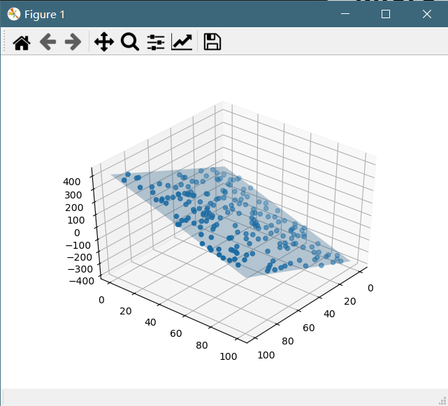
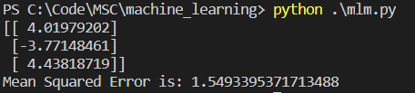
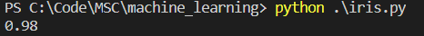

# Micro_ai_edu

**********************
**黄绵秋  复旦大学，大二**

题1-线性回归模型
&emsp;&emsp;将数据进行82分，然后用前八百个进行训练，采用矩阵计算的方式来进行分类，并以MSE作为检验的标准。实际效果如下图：

题2-非线性多分类器
&emsp;&emsp;利用pytorch和BP神经网络进行多分类，在调用数据时直接使用了sklearn中的iris数据。实际结果如下图：
